# DINO ON WHEELS - ASSEMBLY GAME

## Introdução

Este projeto foi desenvolvido por mim, no 2° período da faculdade na matéria de ARQUITETURA DE COMPUTADORES ministrada pelo professor EDUARDO BRAULIO. O jogo é um projeto divertido e educativo que apresenta um personagem chamado DINO, que anda de skate pela estrada. O objetivo principal do jogo é desviar dos obstáculos que estão em constante movimento.

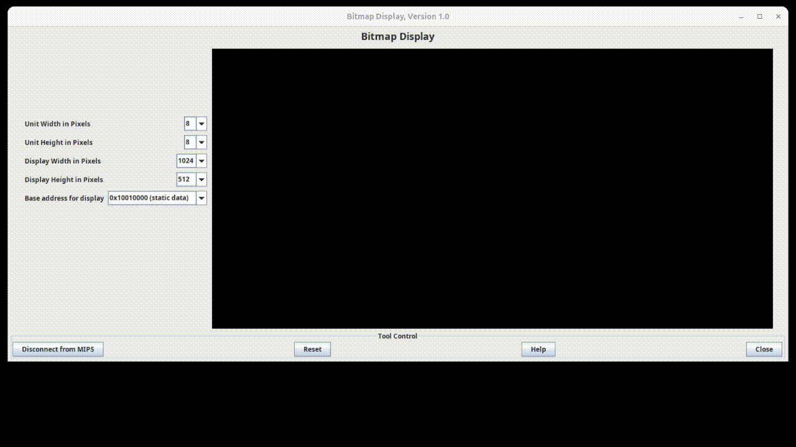

## Sumário

- [Requisitos](#requisitos)
- [Instalação](#instalação)
- [Execução](#execução)
- [Comandos](#comandos)
- [Contribuição](#contribuição)

## Requisitos

- Git
- Java Runtime Environment (JRE)

## Instalação

Passos para configurar o ambiente:

1. **Verifique se já possui os requisitos acima. Caso não possua, procure algum tutorial para atender os requisitos.**

2. **Clone o Repositório:**

    ```bash
    git clone https://github.com/JoaoRobert0/DinoOnWheels-AssemblyGame.git
    ```

3. **Instalação do MARS:**

    - Visite: [MARS Download](https://courses.missouristate.edu/kenvollmar/mars/download.htm)

    - Clique em download:

        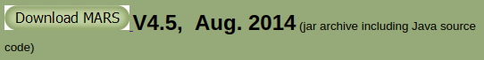

## Execução

Passos para executar o projeto:

1. **Execute o arquivo Mars4_5.jar:**

    - Abra o terminal e execute o seguinte comando:

        ```bash
        java -jar Mars4_5.jar
        ```

2. **Abrindo o projeto clonado no MARS:**

    - Clique no ícone para selecionar a pasta:

        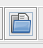

    - Selecione a pasta onde se encontra o projeto e abra o arquivo `DINOSKATE.ASM`:

        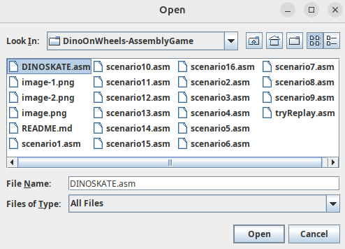

3. **Abrindo a ferramenta de display:**

    - Clique em `Tools`, no canto superior esquerdo:

        

    - Selecione a opção: **Bitmap Display**

        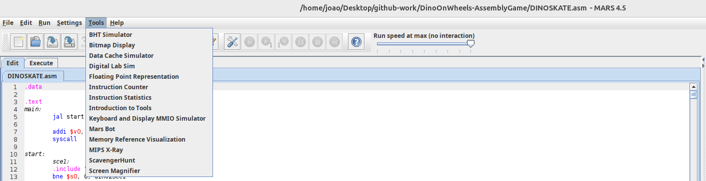

    - Altere os dois primeiros campos para **4 pixels**:
    
        

    - Clique no botão **Connect to MIPS**:

        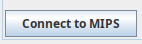

4. **Abrindo a ferramenta de teclado:**

    - Em `Tools` novamente, selecione a opção **Keyboard and Display MMIO Simulator**:

        

    - Clique no botão **Connect to MIPS**:

        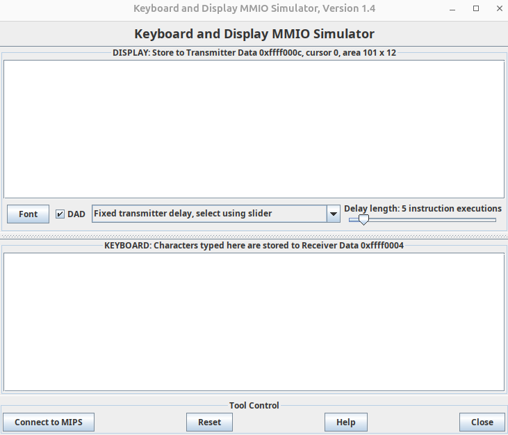

5. **Organizando a Tela:**

    - Separe as duas ferramentas na sua tela:

        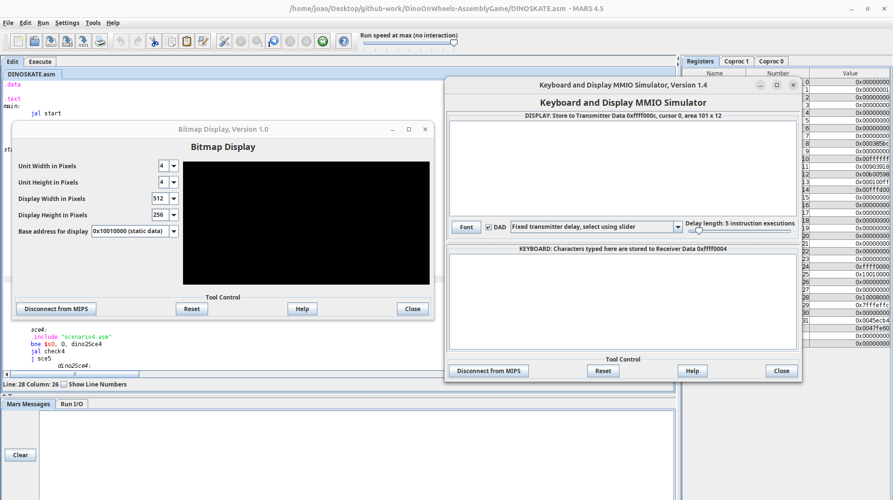

6. **Executando o jogo**

    - Clique no ícone `Run`, no topo da janela:

        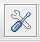

    - Clique no ícone ao lado para iniciar o jogo:

        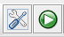

    - Use a área de teclado para digitar as ações:

        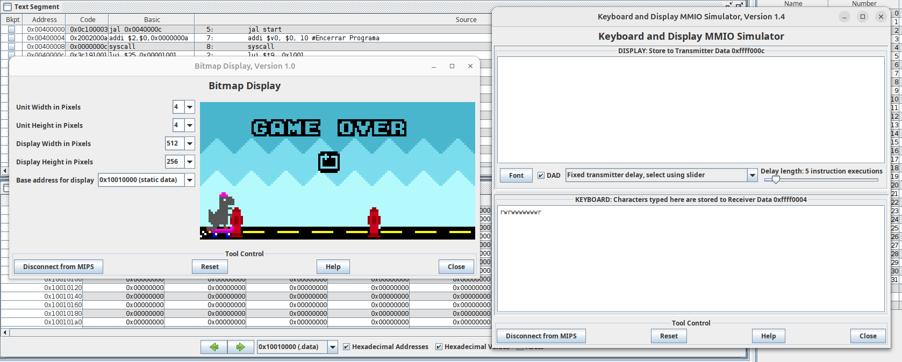

## Comandos

- `w` => Pular
- `r` => Reiniciar

## Contribuição

Se você quiser contribuir com o projeto, siga estas etapas:

1. Faça um fork do repositório.
2. Crie uma branch para suas alterações (`git checkout -b minha-nova-funcionalidade`).
3. Faça commit de suas alterações (`git commit -m 'Adiciona nova funcionalidade'`).
4. Faça push para a branch (`git push origin minha-nova-funcionalidade`).
5. Abra um Pull Request.