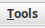
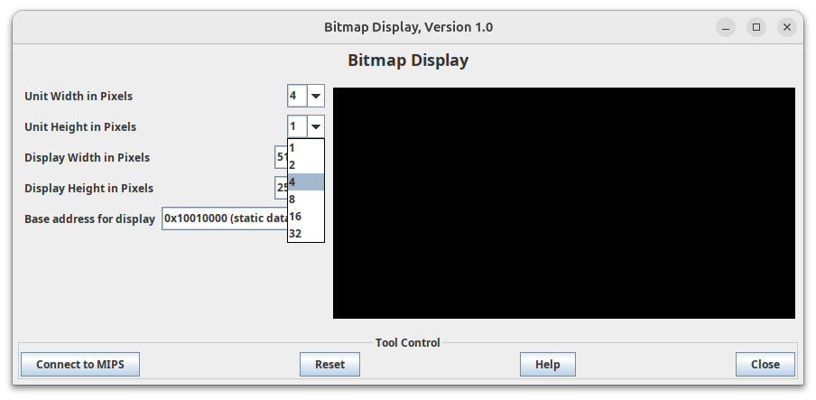

# DINO ON WHEELS - ASSEMBLY GAME

## Introduction

This project was developed by me in the 2nd semester of college for the COMPUTER ARCHITECTURE course taught by Professor EDUARDO BRAULIO. The game is a fun and educational project featuring a character named DINO, who rides a skateboard on the road. The main objective of the game is to avoid the constantly moving obstacles.


## Table of Contents

- [Requirements](#requirements)
- [Installation](#installation)
- [Execution](#execution)
- [Commands](#commands)
- [Contribution](#contribution)

## Requirements

- Git
- Java Runtime Environment (JRE)

## Installation

Steps to set up the environment:

1. **Verify if you have the above requirements. If not, look for a tutorial to meet the requirements.**

2. **Clone the Repository:**

    ```bash
    git clone https://github.com/JoaoRobert0/DinoOnWheels-AssemblyGame.git
    ```

3. **Installing MARS:**

    - Visit: [MARS Download](https://courses.missouristate.edu/kenvollmar/mars/download.htm)

    - Click on download:

        

## Execution

Steps to run the project:

1. **Run the Mars4_5.jar file:**

    - Open the terminal and run the following command:

        ```bash
        java -jar Mars4_5.jar
        ```

2. **Opening the cloned project in MARS:**

    - Click on the icon to select the folder:

        

    - Select the folder where the project is located and open the `DINOSKATE.ASM` file:

        

3. **Opening the display tool:**

    - Click on `Tools` in the upper left corner:

        

    - Select the option: **Bitmap Display**

        

    - Change the first two fields to **4 pixels**:
    
        

    - Click the **Connect to MIPS** button:

        

4. **Opening the keyboard tool:**

    - In `Tools` again, select the **Keyboard and Display MMIO Simulator** option:

        

    - Click the **Connect to MIPS** button:

        

5. **Organizing the Screen:**

    - Arrange the two tools on your screen:

        

6. **Running the game**

    - Click the `Run` icon at the top of the window:

        

    - Click the icon next to it to start the game:

        

    - Use the keyboard area to type actions:

        

## Commands

- `w` => Jump
- `r` => Restart

## Contribution

If you want to contribute to the project, follow these steps:

1. Fork the repository.
2. Create a branch for your changes (`git checkout -b my-new-feature`).
3. Commit your changes (`git commit -m 'Add new feature'`).
4. Push to the branch (`git push origin my-new-feature`).
5. Open a Pull Request.